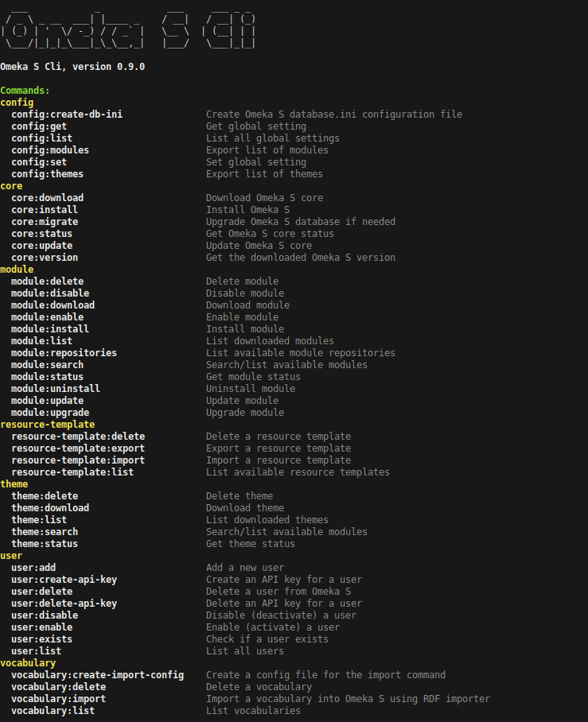

# Omeka-S-Cli

Omeka-S-CLI is a command line tool to manage Omeka S installs.



## Features

- Core
    - Download specific Omeka S version
    - Update Omeka S to any / latest version
    - Install Omeka S (init database, create admin user)
    - Perform database migrations
    - Get core status / version
- Manage modules
    - Search and download modules from [official Omeka S module repository](https://omeka.org/s/modules/) and [Daniel Berthereau's module repository](https://daniel-km.github.io/UpgradeToOmekaS/en/omeka_s_modules.html)
    - Download modules from git repositories
    - Install, update, upgrade, enable, disable and delete modules
    - List all downloaded modules and their status
- Manage themes
    - Search and download themes from the [official Omeka S theme repository](https://omeka.org/s/themes/)
    - Download themes from git repositories
    - Delete downloaded themes
    - List all downloaded themes and their status
- Config
    - Export list of installed modules and themes
    - Get, set and list global settings
    - Create database.ini file
- User
    - Add a new user

## Usage

    omeka-s-cli [ - h | --help ]
    omeka-s-cli <command> --help
    omeka-s-cli <command> [options]

### List modules
```
# omeka-s-cli module:list

Omeka S found at /var/www/omeka-s
+------------+-------------+---------------+-----------------------------+------------------+
| Id         | Name        | State         | Version                     | Update Available |
+------------+-------------+---------------+-----------------------------+------------------+
| Common     | Common      | active        | 3.4.66                      | 3.4.68           |
| EasyAdmin  | Easy Admin  | active        | 3.4.30                      | 3.4.31           |
| IiifServer | IIIF Server | not_installed | 3.6.21                      | 3.6.25           |
| Log        | Log         | needs_upgrade | 3.4.29 (3.4.28 in database) | up to date       |
+------------+-------------+---------------+-----------------------------+------------------+
```

### Download module from the official repository

```
# omeka-s-cli module:download --force common

Omeka S found at /var/www/omeka-s
Download https://github.com/Daniel-KM/Omeka-S-module-Common/releases/download/3.4.68/Common-3.4.68.zip ... done
Remove previous version ... done
Move module to folder /var/www/omeka-s/modules/Common ... done
Cleaning up /tmp/omeka-s-cli.18fb088b ... done
Module 'Common' successfully downloaded.
```

The module already exists, so we use the --force option to replace it with the latest version.

### Download module from git repository

```
# omeka-s-cli module:download https://github.com/GhentCDH/Omeka-S-module-AuthCAS.git

Omeka S found at /var/www/omeka-s
Download https://github.com/GhentCDH/Omeka-S-module-AuthCAS.git ... done
Move module to folder /var/www/omeka-s/modules/AuthCAS ... done
Module 'AuthCAS' successfully downloaded.
```

The installer will run `composer install` in the module directory if a `composer.lock` file is present. Other dependencies must be installed manually.

### Download specific module version

```
omeka-s-cli module:download common:3.4.67
```

```
omeka-s-cli module:download https://github.com/GhentCDH/Omeka-S-module-AuthCAS.git#v1.0.2
```

### Download theme from the official repository

```
# omeka-s-cli theme:download freedom

Omeka S found at /var/www/omeka-s
Download https://github.com/omeka-s-themes/freedom/releases/download/v1.0.7/freedom-v1.0.7.zip ... done
Move theme to folder /var/www/omeka-s/themes/freedom ... done
Cleaning up /tmp/omeka-s-cli.0ea2a8f4 ... done
Theme 'freedom' successfully downloaded.
```

## Requirements

- PHP (>= 8.1) with PDO_MySQL and Zip enabled
- Omeka S (>= 4)

## Installation

- Download [omeka-s-cli.phar](https://github.com/GhentCDH/Omeka-S-Cli/releases/latest/download/omeka-s-cli.phar) from the latest release.
- Run with `php omeka-s-cli.phar` or move it to a directory in your PATH and make it executable.

## Build

This project uses https://github.com/box-project/box to create a phar file.

### box global install

```bash
composer global require humbug/box
```
### compile phar

```bash
box compile
```

## To do

- [ ] Download/update multiple modules at once
- [ ] Module dependency checking
- [ ] Add support for resource templates
- [ ] Add support for sites and site pages
- [ ] Add support for API keys

## Credits

Built @ the [Ghent Center For Digital Humanities](https://www.ghentcdh.ugent.be/), Ghent University by:

* Frederic Lamsens

Inspired by:

- [Libnamic Omeka S Cli](https://github.com/Libnamic/omeka-s-cli/)
- [biblibre Omeka CLI](https://github.com/biblibre/omeka-cli)