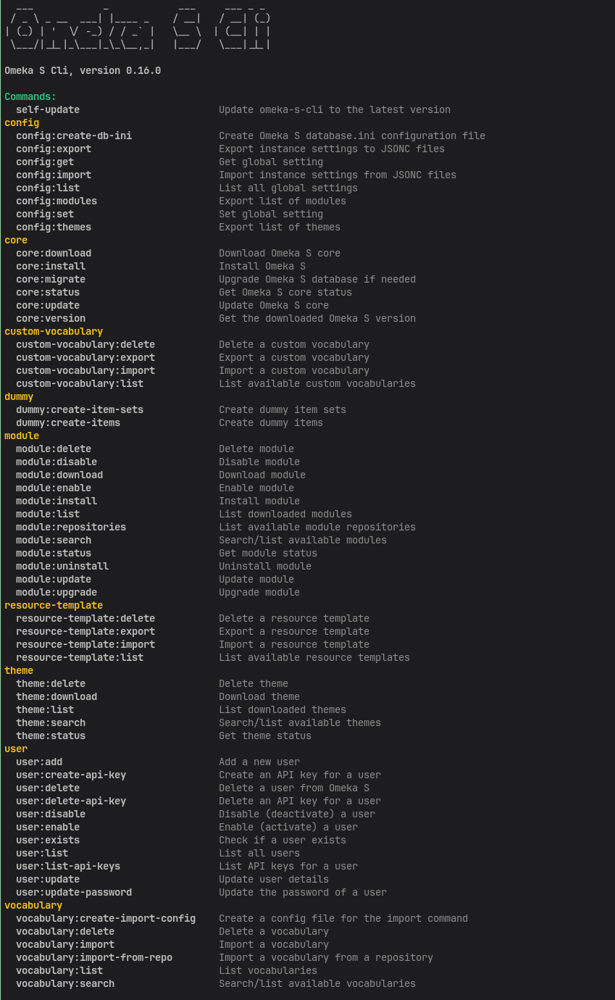

# Omeka-S-Cli

Omeka-S-Cli is a command line tool to manage Omeka S instances.



## Features

- Core
    - Download specific Omeka S version
    - Update Omeka S to any/latest version
    - Install Omeka S (init database, create admin user)
    - Perform database migrations
    - Get core status/version
- Manage modules
    - Search and download modules from [official Omeka S module repository](https://omeka.org/s/modules/) and [Daniel Berthereau's module repository](https://daniel-km.github.io/UpgradeToOmekaS/en/omeka_s_modules.html)
    - Download modules from git repositories
    - Install, update, upgrade, enable, disable and delete modules
    - List all downloaded modules and their status
    - Batch update, upgrade, delete, uninstall modules
- Manage themes
    - Search and download themes from the [official Omeka S theme repository](https://omeka.org/s/themes/)
    - Download themes from git repositories
    - Delete downloaded themes
    - List all downloaded themes and their status
- Manage resource templates
    - Import and export resource templates from/to JSON files
    - List all resource templates
    - Delete resource templates
- Manage vocabularies
    - Import vocabularies from file or url
    - Import vocabularies from JSON config file
    - Create JSON import configuration files 
    - List all vocabularies
    - Delete vocabularies
- Dummy data
    - Generate dummy items and item sets with configurable generators
- Config
    - Export list of installed modules and themes
    - Get, set and list global settings
    - Create database.ini file
- User
    - List all users
    - Add, delete, update, set password, enable or disable a user
    - Manage API keys for a user
- Blueprints
    - Deploy an environment from a single declarative blueprint file (modules, themes, vocabularies, resource templates, users, settings)

### Automating Omeka S instance setup

The Omeka-S-Cli tool can be used to automate the setup and configuration of new Omeka S instances.  A typical workflow is:

- Download and install Omeka S
    - `core:download <path> [version]` to download Omeka S
    - `config:create-db-ini --dbname <dbname> --username <username> --password <password> --host <host> --port <port>` to create the database.ini file
    - `core:install --admin-name <admin-name> --admin-email <admin-email> --admin-password <admin-password>` to run the Omeka S installer
- Add users
    - `user:add <email> <name> <role> [password]` to add users
    - `user:create-api-key <user-id-or-email> <label>` to add API keys for users
- Download and install modules and themes
    - `module:download <module>` to download a module
    - `module:install <module>` to install a module
    - `theme:download <theme>` to download a theme
- Import vocabularies
    - `vocabulary:import --url <url> --namespace-uri="<uri>" --prefix="<prefix>" --label="<label>"` to import a vocabulary from a URL (or `--file <path>`)
    - `vocabulary:import --config <file>` to import a vocabulary from a JSON config file
- Import resource templates
    - `resource-template:import <file>` to import resource templates
- Set config options
    - `config:set <id> <value>` to set global settings

### Deploy from a blueprint

Instead of scripting the steps above, you can describe the desired environment in a single
declarative **blueprint** file and deploy it in one command. The format is a backward-compatible
superset of the [Omeka S Playground](https://github.com/ateeducacion/omeka-s-playground) blueprint.

```bash
# validate first (also validates a standalone list with --as)
omeka-s-cli blueprint:validate ./site.blueprint.jsonc

# preview the ordered actions without changing anything
omeka-s-cli blueprint:deploy ./site.blueprint.jsonc --dry-run

# deploy onto an existing Omeka S instance
omeka-s-cli blueprint:deploy ./site.blueprint.jsonc --skip core
```

A small blueprint (jsonc — comments and trailing commas allowed):

```jsonc
{
    "modules": [
        { "name": "Common", "state": "activate" },
        { "name": "Log", "state": "download" },        // downloaded, not installed
        { "$import": "./modules.extra.jsonc" }          // reuse a shared module list
    ],
    "vocabularies": [
        { "prefix": "schema", "namespaceUri": "https://schema.org/", "label": "schema.org",
          "url": "https://schema.org/version/latest/schemaorg-current-https.rdf" }
    ],
    "resourceTemplates": [ { "source": "../resource-template/base_resource.json" } ],
    "settings": { "installation_title": "Blueprint Demo" }
}
```

`blueprint:deploy` runs the phases in order (core → modules → themes → vocabularies → resource
templates → users → settings), reusing the same commands documented above, and is idempotent —
re-running it skips resources that already exist (pass `--update` to refresh them).

It can also **build a site from scratch**: the core phase downloads and installs Omeka S, so one
command goes from an empty server to a running site (database and admin details are passed as flags,
never stored in the blueprint):

```bash
omeka-s-cli blueprint:deploy ./site.blueprint.jsonc --base-path /var/www/omeka-s \
    --db-host localhost --db-name omeka --db-user omeka --db-password secret \
    --admin-email admin@example.com --admin-password secret
```

The database must already exist. Deploying onto an already-installed instance requires `--force`
(with the core phase this **resets** it — wiping the database and reinstalling; use `--skip core
--force` to sync config without wiping). See [docs/blueprint.md](docs/blueprint.md) for the full
reference, [docs/blueprint-guide.md](docs/blueprint-guide.md) for a plain-language guide, and
[examples/blueprint/](examples/blueprint/) for a working example.

## Usage

    omeka-s-cli [ - h | --help ]
    omeka-s-cli <command> --help
    omeka-s-cli <command> [options]

### Example: List downloaded modules
```
omeka-s-cli module:list
```

```
+--------------------------+----------------------------+---------------+---------+------------------+---------------+-----------------+
| Id                       | Name                       | State         | Version | InstalledVersion | LatestVersion | UpdateAvailable |
+--------------------------+----------------------------+---------------+---------+------------------+---------------+-----------------+
| AdvancedResourceTemplate | Advanced Resource Template | active        | 3.4.43  | 3.4.43           | 3.4.45        | yes             |
| AdvancedSearch           | Advanced Search            | not_installed | 3.4.51  |                  | 3.4.51        |                 |
| Common                   | Common                     | active        | 3.4.72  | 3.4.72           | 3.4.72        |                 |
+--------------------------+----------------------------+---------------+---------+------------------+---------------+-----------------+
```

You can export almost any command output with the `--json` option.

### Example: Download a module from a repository

The easiest way to download a module is to use its official name. The downloader will search the name in one of the supported module repositories and automatically download the latest version compatible with the installed Omeka S core version.

```
# omeka-s-cli module:download common
```

If the module already exists, you can use the `--force` option to replace it with the newly downloaded version.

You can download a specific module version using the `<module>:<version>` syntax:

```
omeka-s-cli module:download common:3.4.67
```

The official Omeka S module repository does not always have all versions available. In that case, you can use a url to a zip-release or a git repository.

### Example: Download a module from a zip release

```
omeka-s-cli module:download https://github.com/Daniel-KM/Omeka-S-module-Common/releases/download/3.4.65/Common-3.4.65.zip
```

### Example: Download a module from a git repository

```
omeka-s-cli module:download https://github.com/GhentCDH/Omeka-S-module-AuthCAS.git
```

You can use the short `gh:user/repo` syntax for GitHub repositories:

```
omeka-s-cli module:download gh:GhentCDH/Omeka-S-module-AuthCAS
```
You can checkout a specific tag, branch or commit by appending `#<branch|tag|commit>`.

```
omeka-s-cli module:download https://github.com/Daniel-KM/Omeka-S-module-AdvancedSearch.git#3.4.22
omeka-s-cli module:download gh:Daniel-KM/Omeka-S-module-AdvancedSearch#3.4.22
```

The installer will run `composer install` in the module directory if a `composer.lock` file is present. Other dependencies must be installed manually.

### Example: Download a theme

The theme downloader also automatically selects the latest version compatible with the installed Omeka S core version.

```
omeka-s-cli theme:download freedom
```

Or using the GitHub repository:

```
omeka-s-cli gh:omeka-s-themes/freedom#v1.0.6
```

### Example: Import a vocabulary
Directly from a URL (or a local file with `--file`):
```bash
omeka-s-cli vocabulary:import --url "https://schema.org/version/latest/schemaorg-current-https.rdf" --namespace-uri="https://schema.org/" --prefix="schema" --label="schema.org"
```

Or from a JSON config file with the same fields. First create a JSON file:
```json
{
    "url": "https://schema.org/version/latest/schemaorg-current-https.rdf",
    "label": "schema.org",
    "namespaceUri": "https://schema.org/",
    "prefix": "schema"
}
```
Then import it:
```bash
omeka-s-cli vocabulary:import --config ./schema-dot-org.json
```

Or from a repository such as [LOV](https://lov.linkeddata.es/) — search, then import by `<repository>:<prefix>`:
```bash
omeka-s-cli vocabulary:search event
omeka-s-cli vocabulary:import-from-repo lov:event
```

### Example: Create dummy items

```bash
# 100 items using built-in defaults
omeka-s-cli dummy:create-items 100

# 100 items from a config file
omeka-s-cli dummy:create-items 100 --config ./examples/dummy/item.json
```

```bash
omeka-s-cli dummy:create-item-sets 10
omeka-s-cli dummy:create-item-sets 10 --config ./examples/dummy/item-set.json
```

See [docs/dummy.md](docs/dummy.md) for the full generator and config reference.

### Example: Import a resource template
Import a resource template from a file with:
```bash
omeka-s-cli resource-template:import "/path/to/template.json"
```

You can also specify a different label:
```bash
omeka-s-cli resource-template:import "/path/to/template.json" --label="My Custom Template"
```

Update an existing template by ID:
```bash
omeka-s-cli resource-template:import "/path/to/template.json" 2
```

Update an existing template by label:
```bash
omeka-s-cli resource-template:import "/path/to/template.json" "My Custom Template"
```

## Requirements

- PHP (>= 8.1) with PDO_MySQL and Zip enabled
- Omeka S (>= 4)

## Installation

- Download [omeka-s-cli.phar](https://github.com/GhentCDH/Omeka-S-Cli/releases/latest/download/omeka-s-cli.phar) from the latest release.
- Run with `php omeka-s-cli.phar` or move it to a directory in your PATH and make it executable.

## Build

This project uses https://github.com/box-project/box to create a phar file.

### box global install

```bash
composer global require humbug/box
```
### compile phar

```bash
box compile
```

## To do

- [ ] Module dependency checking
- [ ] Add support for custom vocabularies
- [ ] Add support for sites and site pages

## Credits

Built @ the [Ghent Center For Digital Humanities](https://www.ghentcdh.ugent.be/), Ghent University by:

* Frederic Lamsens

Built with:

- [adhocore/cli](https://github.com/adhocore/php-cli) — CLI framework
- [fakerphp/faker](https://github.com/FakerPHP/Faker) — fake data generation

Code copied from third-party sources:

- `resource-template:import` — `flagValid()` and `checkMissingDependencies()` methods copied from
  [Common module](https://gitlab.com/Daniel-KM/Omeka-S-module-Common)
  by [Daniel Berthereau](https://gitlab.com/Daniel-KM), © 2020–2025

Inspired by:

- [Libnamic Omeka S Cli](https://github.com/Libnamic/omeka-s-cli/)
- [biblibre Omeka CLI](https://github.com/biblibre/omeka-cli)