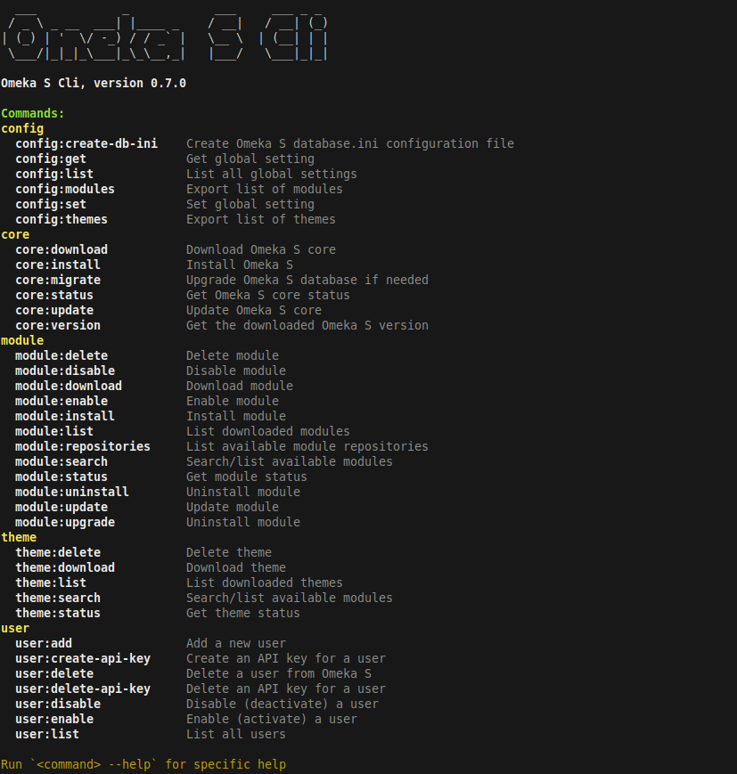

# Omeka-S-Cli

Omeka-S-CLI is a command line tool to manage Omeka S installs.



## Features

- Core
    - Download specific Omeka S version
    - Update Omeka S to any / latest version
    - Install Omeka S (init database, create admin user)
    - Perform database migrations
    - Get core status / version
- Manage modules
    - Search and download modules from [official Omeka S module repository](https://omeka.org/s/modules/) and [Daniel Berthereau's module repository](https://daniel-km.github.io/UpgradeToOmekaS/en/omeka_s_modules.html)
    - Download modules from git repositories
    - Install, update, upgrade, enable, disable and delete modules
    - List all downloaded modules and their status
- Manage themes
    - Search and download themes from the [official Omeka S theme repository](https://omeka.org/s/themes/)
    - Download themes from git repositories
    - Delete downloaded themes
    - List all downloaded themes and their status
- Config
    - Export list of installed modules and themes
    - Get, set and list global settings
    - Create database.ini file
- User
    - Add a new user

## Usage

    omeka-s-cli [ - h | --help ]
    omeka-s-cli <command> --help
    omeka-s-cli <command> [options]

### Example: List modules
```
omeka-s-cli module:list
```

```
+--------------------------+----------------------------+---------------+---------+------------------+---------------+-----------------+
| Id                       | Name                       | State         | Version | InstalledVersion | LatestVersion | UpdateAvailable |
+--------------------------+----------------------------+---------------+---------+------------------+---------------+-----------------+
| AdvancedResourceTemplate | Advanced Resource Template | active        | 3.4.43  | 3.4.43           | 3.4.45        | yes             |
| AdvancedSearch           | Advanced Search            | not_installed | 3.4.51  |                  | 3.4.51        |                 |
| Common                   | Common                     | active        | 3.4.72  | 3.4.72           | 3.4.72        |                 |
+--------------------------+----------------------------+---------------+---------+------------------+---------------+-----------------+
```

You can export almost any command output with the `--json` option.

### Example: Download a module

The easiest way to download a module is to use its official name. The downloader will search the name in one of the supported module repositories and download a the latest zip release. 

```
# omeka-s-cli module:download common
```

If the module already exists, you can use the `--force` option to replace it with the latest version.

#### Download a specific module version

You can download a specific module version using the `<module>:<version>` syntax:

```
omeka-s-cli module:download common:3.4.67
```

### Example: Download module from a git repository

```
omeka-s-cli module:download https://github.com/GhentCDH/Omeka-S-module-AuthCAS.git
```

You can use the short `gh:user/repo` syntax for GitHub repositories:

```
omeka-s-cli module:download gh:GhentCDH/Omeka-S-module-AuthCAS
```
You can checkout a specific tag, branch or commit by appending `#<branch|tag|commit>`.

```
omeka-s-cli module:download https://github.com/Daniel-KM/Omeka-S-module-AdvancedSearch.git#3.4.22
omeka-s-cli module:download gh:Daniel-KM/Omeka-S-module-AdvancedSearch#3.4.22
```

The installer will run `composer install` in the module directory if a `composer.lock` file is present. Other dependencies must be installed manually.

### Example: Download a theme

```
omeka-s-cli theme:download freedom
```

Or using the GitHub repository:

```
omeka-s-cli gh:omeka-s-themes/freedom#v1.0.6
```

## Requirements

- PHP (>= 8.1) with PDO_MySQL and Zip enabled
- Omeka S (>= 4)

## Installation

- Download [omeka-s-cli.phar](https://github.com/GhentCDH/Omeka-S-Cli/releases/latest/download/omeka-s-cli.phar) from the latest release.
- Run with `php omeka-s-cli.phar` or move it to a directory in your PATH and make it executable.

## Build

This project uses https://github.com/box-project/box to create a phar file.

### box global install

```bash
composer global require humbug/box
```
### compile phar

```bash
box compile
```

## To do

- [ ] Download/update multiple modules at once
- [ ] Module dependency checking
- [ ] Add support for resource templates
- [ ] Add support for sites and site pages
- [ ] Add support for API keys

## Credits

Built @ the [Ghent Center For Digital Humanities](https://www.ghentcdh.ugent.be/), Ghent University by:

* Frederic Lamsens

Inspired by:

- [Libnamic Omeka S Cli](https://github.com/Libnamic/omeka-s-cli/)
- [biblibre Omeka CLI](https://github.com/biblibre/omeka-cli)